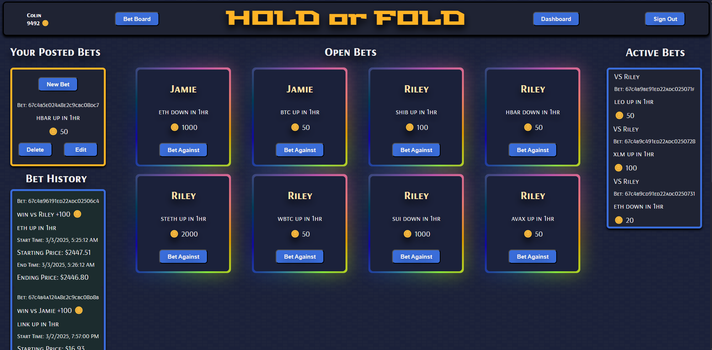
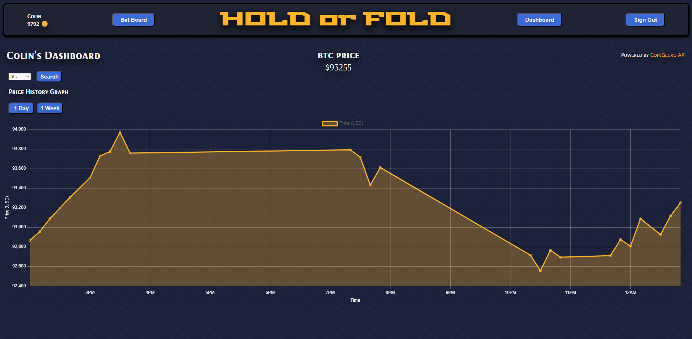

# HOLD OR FOLD




## Description
HOLD or FOLD is a full-stack web application that allows users to track cryptocurrency prices and place bets on whether a coin's price will go up or down within a given time period. Users can compete against each other using a fake currency called tokens. The app provides real-time market data and a thrilling betting experience for crypto enthusiasts.

This project was built to combine cryptocurrency price tracking with a competitive, gamified betting system. The goal is to create an engaging and educational platform where users can test their market predictions in a risk-free environment.

## Getting Started

-   **Deployed App**: [Hold or Fold][deployed]
-   **Planning Materials**: [Trello Board][planning]

[deployed]: https://hold-or-fold-f5c8c8cb18fe.herokuapp.com/
[planning]: https://trello.com/b/r9tu3dt4/hold-or-fold

### Installation (For Local Development)

1. Clone the repository:
    ```sh
    git clone https://github.com/yourusername/hold-or-fold.git
    ```
2. Navigate to the project folder:
    ```sh
    cd hold-or-fold
    ```
3. Install dependencies:
    ```sh
    npm install
    ```
4. Set up environment variables in a .env file:
    ```sh
    MONGO_URI=your_mongo_connection_string
    API_KEY=your_api_key
    ```
5. Start the server:
    ```sh
    npm start
    ```

## Attributions

CoinGecko API - Used for real-time cryptocurrency price data.

Express.js, MongoDB, and EJS documentation for development reference.

Open-source libraries for styling and UI enhancements.

Chart.JS for rendering the crypto prices chart.

## Technologies Used

Backend: Node.js, Express.js, MongoDB.

Frontend: EJS, HTML, CSS.

Chart.JS: Dashboard chart.

APIs: CoinGecko API (for cryptocurrency data).

Deployment: Heroku.

## Next Steps

Implement a leaderboard to rank users based on total tokens won.

Add WebSockets for real-time bet updates without needing page refreshes.

Introduce a friends system for private betting matches.

Develop a mobile-friendly UI for better accessibility on smaller screens.

Create a statistics dashboard to track users’ betting history and performance.
